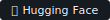
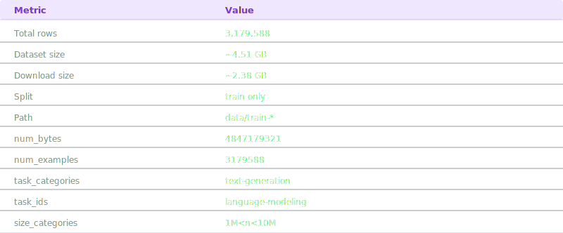
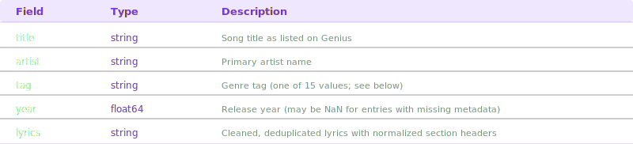
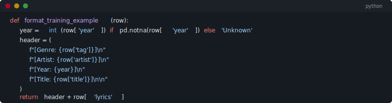

<p align="center">
  
</p>

<p align="center">
  <a href="https://huggingface.co/datasets/theelderemo/genius-lyrics-cleaned">
    
  </a>
</p>

<p align="center">
  
</p>

A heavily cleaned, English-only, genre-filtered subset of the [Genius Song Lyrics with Language Information](https://www.kaggle.com/datasets/carlosgdcj/genius-song-lyrics-with-language-information) Kaggle dataset. Reduced from **9+ GB to 2.56 GB** through language filtering, genre filtering, artifact removal, and deduplication. Optimized for language model fine-tuning, lyric generation, and music NLP research.  

<p align="center">
  
</p>

<p align="center">
  
</p>

This dataset ships as a single `train` split. You should create validation and test splits appropriate to downstream task  

<p align="center">
  
</p>  

<br>

The raw Genius dataset contains millions of song entries across dozens of languages, genres, and quality levels — including non-music content like poetry, book excerpts, and miscellaneous text tagged as `misc`. This cleaned version retains only **English-language songs from verified music genres**, with lyrics scrubbed of Genius UI artifacts, HTML residue, and duplicates. The result is a high-signal corpus suitable for causal language model pretraining or supervised fine-tuning on lyric generation tasks.

<p align="center">
  
</p>

<p align="center">
  
</p>

<p align="center">
  
</p>  

<br>

**The following steps were applied in order:**

</div>

1. **Language filter** — Retained only rows where `language == 'en'`, removing all non-English entries.
2. **Genre filter** — Dropped the `misc` tag (which contains books, poems, speeches, and other non-music content). Retained only the 15 confirmed music genre tags listed below.
3. **Artifact removal** — Applied regex cleaning to remove:
    - Genius embed counters (e.g., `1234Embed` at end of lyrics)
   - UI strings like `"See [Artist] Live"`, `"Get tickets"`, `"You might also like"`
   - Residual HTML tags (`<...>`)
4. **Section header normalization** — Simplified attributed headers: `[Chorus: Cam'ron & Jay-Z]` → `[Chorus]`, preserving verse structure while removing contributor meta.
5. **Whitespace normalization** — Collapsed 3+ consecutive newlines to 2, and collapsed horizontal whitespace.
6. **Stub removal** — Dropped any entry whose cleaned lyrics are under 100 characters.
7. **Exact deduplication** — Removed entries with identical cleaned lyrics.
8. **Near-deduplication** — For entries sharing the same `artist` + `title`, retained the version with the highest view count.

<p align="center">
  
</p>

<p align="center">
  
</p>

<p align="center">
  
</p>

<p align="center">
  
</p>

<p align="center">
  
</p>

<p align="center">
  
</p>

<p align="center">
  
</p>

<p align="center">
  
</p>

<p align="center">
  
</p>

<p align="center">
  
</p>

<p align="center">
  
</p>

<p align="center">
  
</p>

<p align="center">
  
</p>

<p align="center">
  
</p>

<p align="center">
  
</p>

If you use this dataset in research or a project, please cite both the upstream Kaggle source and this repository:

```bibtex
@misc{christopher_dickinson_2026,
	author       = { Christopher Dickinson },
	title        = { genius-lyrics-cleaned (Revision 9742989) },
	year         = 2026,
	url          = { https://huggingface.co/datasets/theelderemo/genius-lyrics-cleaned },
	doi          = { 10.57967/hf/7978 },
	publisher    = { Hugging Face }
}
```